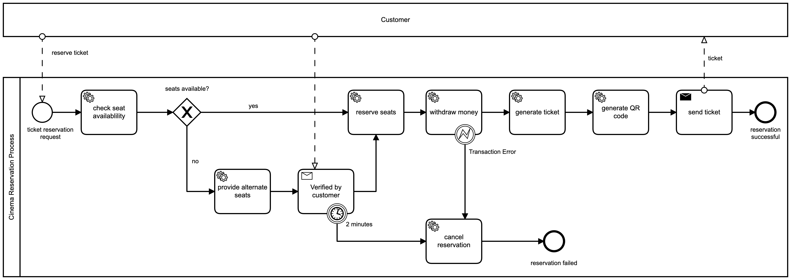

## Micronaut Zeebe Cinema
Micronaut Zeebe Cinema is a showcase for the Camunda Cloud platform and the Micronaut Zeebe intergration by Novatec

### Tech Stack
- Zeebe 1.2.x
- Micronaut 3.x
- Java 11

### Techniques
- Zeebe Workers in Micronaut
- BPMN
    - Messages
    - Errors
    - Timer
    - Gateways

## Process Model

## How to run it
- setup a camunda cloud instance / zeebe engine
    - remote
        - generate a client configuration on your Camunda Cloud account (tab API)
        - add your camunda cloud cluster credentials to the `src/main/resources/application.yml`
    - local
        - start a local containerized zeebe/optimize setup (see `docker/docker-compose.yml`)
- start the application
    - run `./gradlew bootRun` from your terminal
    - use your IDE to start the application
- use a REST client to make a reservation:
    - endpoint `localhost:8089/reservation/movie`
    - GET request
        - localhost:8089/reservation/movie/{movie}?seats=A1,A2&userId=max.mustermann
        - {movie} can be any string for a movie e.g. 'the-bpmn-movie'
- check the log output or Optimize for the progress (maybe you need to refine log levels -> Zeebe is very noisy in DEBUG)
- in case alternative seats are offered 
    - you can check your log for an offer link: `To accept these seats, click the following link: ...`
    - clicking the link triggers the message correlation, otherwise the process stops after 2min
- you can also check Optimize to see incicents or running instances under http://localhost:8080 -> user/pw is demo/demo
